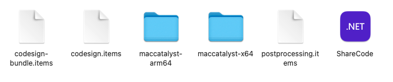
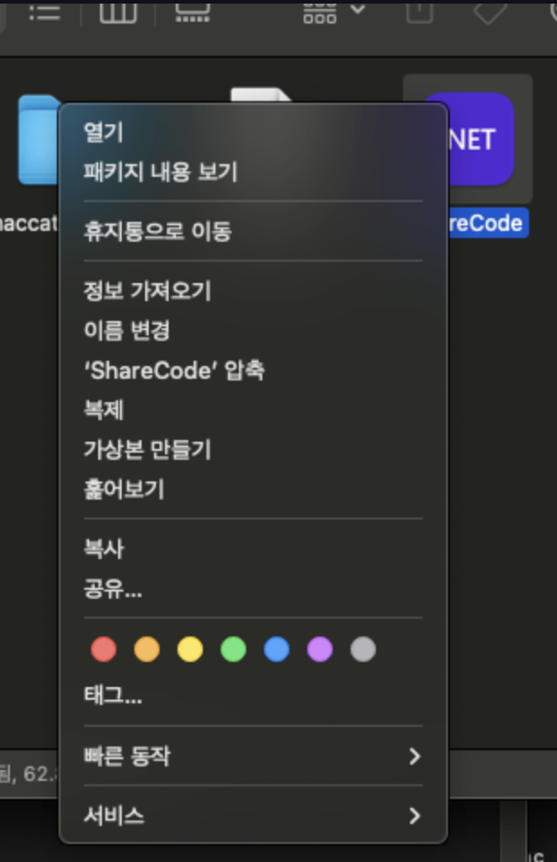
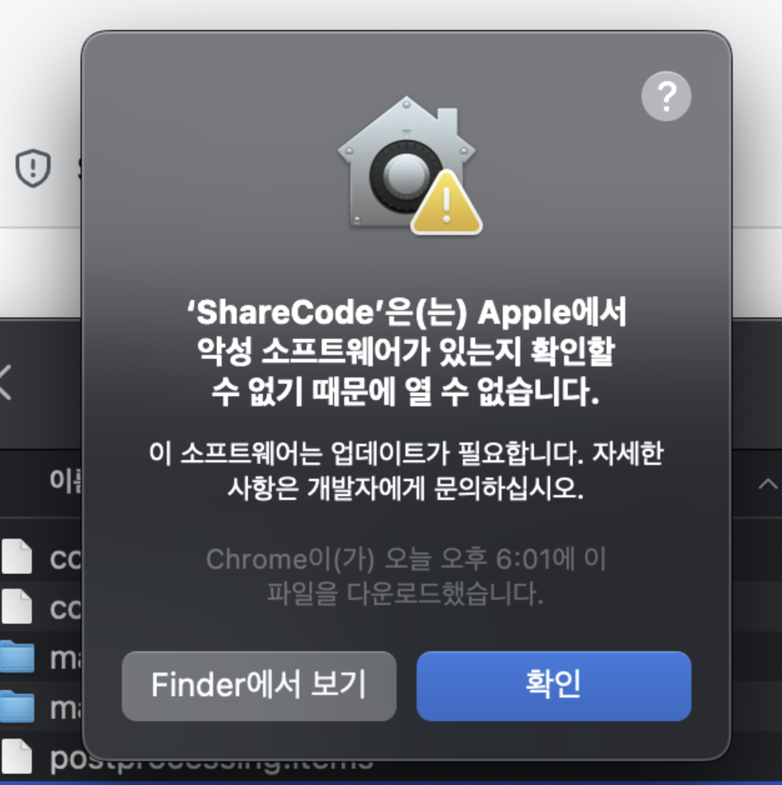
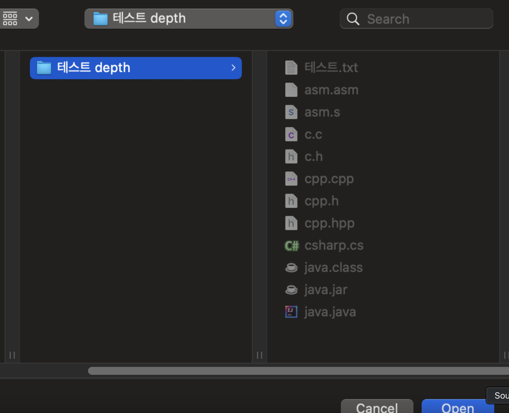
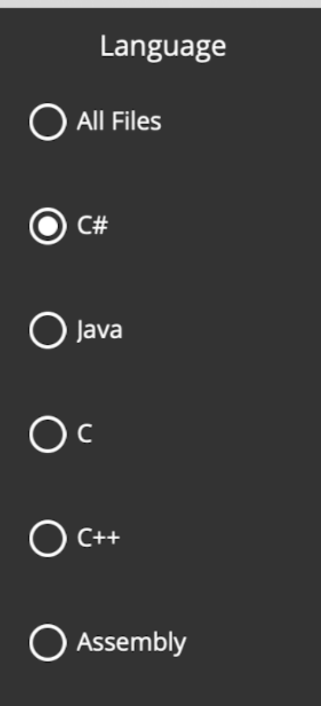
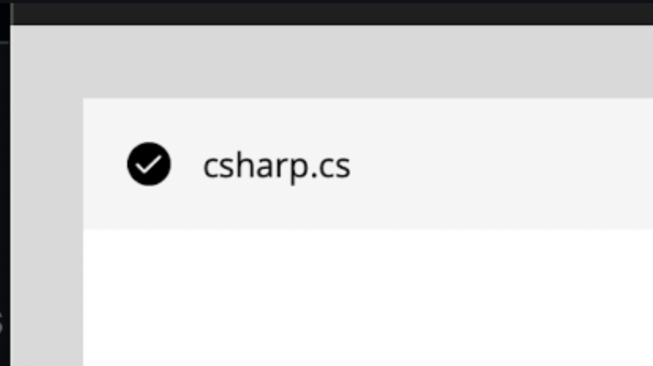
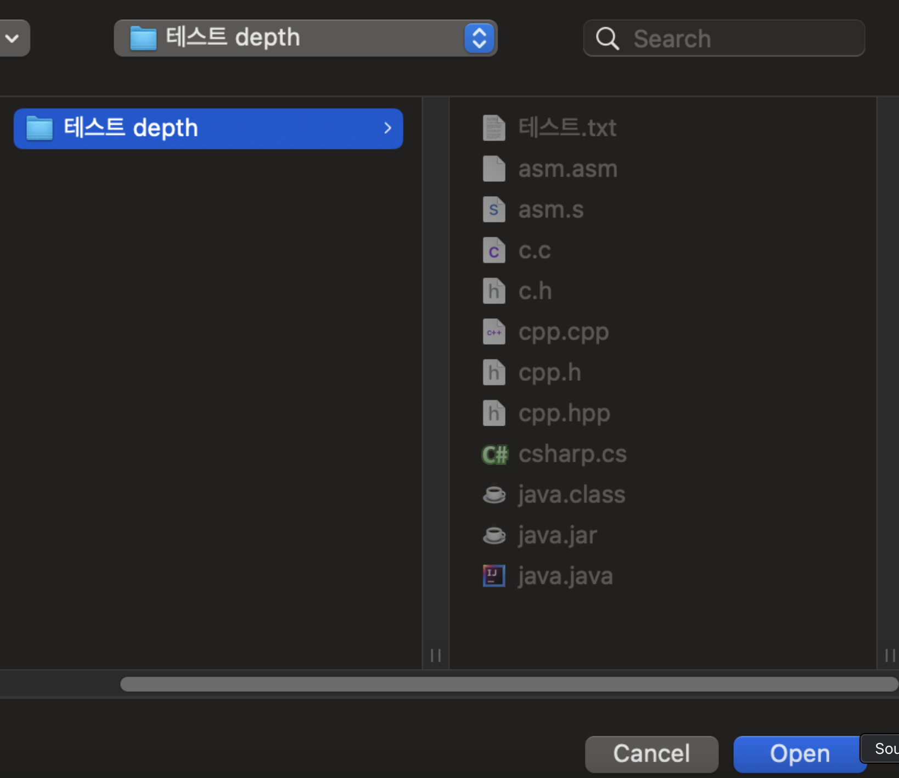
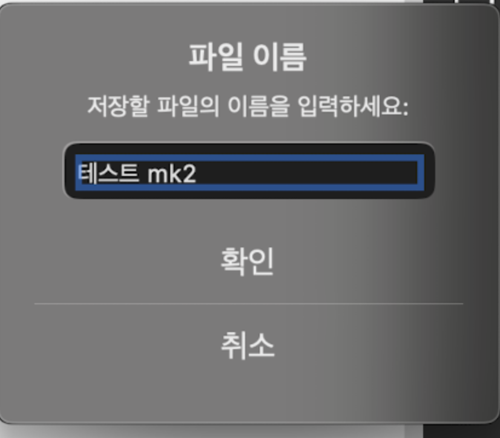
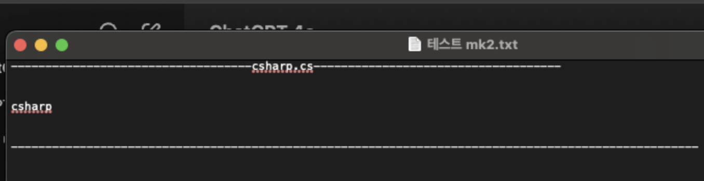

# ShareCode 개요

- 수강생 '소년D'님이 개발하신 [PSYC (Please Share Your Code)](https://github.com/junghyunhwang/PleaseShareYourCode) 모티브로 개발하였습니다.
- macOS에서 사용 가능합니다

# 주요 기능

- 코드 공유 과정을 간편하게 처리할 수 있습니다.

# 사용법

## 1. 오른쪽 Release 탭에서 최신 버전을 다운로드합니다.

## 2. 알축을 풀고 실행합니다.

ShareCode를 우클릭 - 열기 하여 실행합니다.

더블클릭하면 위와 같은 에러가 발생합니다. 반드시 우클릭-열기로 켜주세요

## 3. Open 버튼을 클릭하여 폴더를 선택합니다.

추출할 파일들이 들어있는 폴더를 선택하고 Open을 클릭합니다.

## ## 4. 추출하려는 확장자를 클릭합니다.

5. 추출하려는 파일들을 체크박스로 선택합니다.

## 6. Export 버튼을 클릭하여 파일을 추출합니다.

## 7. 저장할 대상 폴더를 선택하고 Open버튼을 누르고 파일을 저장합니다

## 8. 확인

## 사용 영상 동영상 링크

# 차이점

- Windows 환경에서 WinForm으로 개발된 프로그램은 macOS에서 실행되지 않아, MAUI를 사용해 동일한 기능을 구현한 프로그램을을 개발하였습니다.

# 개발환경

Rider, Net 8.0, MAUI